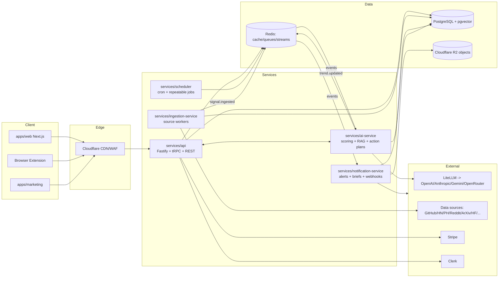
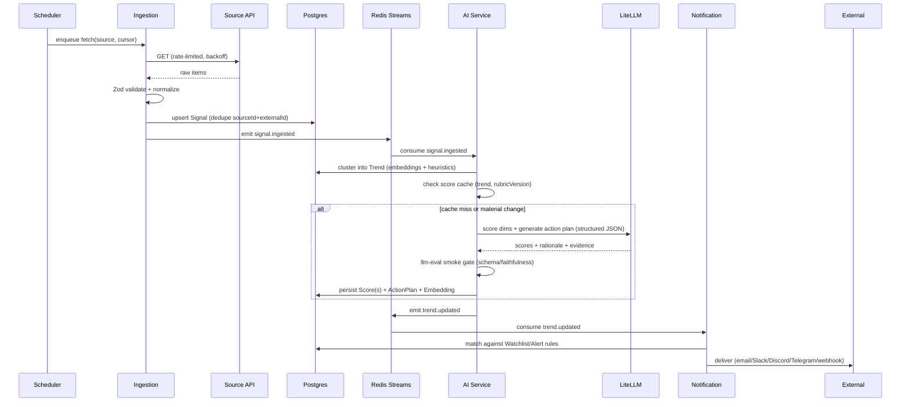

# System Design (HLD + LLD)

**Phase 15 · Status: complete · Last updated: 2026-07-03**
**Traces to:** [TRD](../01-product/TECHNICAL_REQUIREMENTS_DOCUMENT.md) · [DB](../04-data/DATABASE_DESIGN.md) · [API](../05-api/API_DESIGN.md)

## 1. High-Level Design (component view)

- **Sync plane:** clients → Cloudflare → `services/api` (tRPC internal, REST public) → Postgres/Redis.
- **Async plane:** `scheduler` → `ingestion-service` → event `signal.ingested` → `ai-service`
  (scores/RAG/action plans) → event `trend.updated` → `notification-service` (alerts/briefs/webhooks).
- `packages/ai-sdk` is the only path to LLMs (LiteLLM + Langfuse). `packages/database` owns Prisma.

## 2. Key sequence — signal → trend → scorecard → alert

## 3. Low-Level Design notes
- **Clustering:** new signal → embed → nearest-trend search (pgvector cosine, threshold) + rule
  heuristics (shared entities/urls/time window). Below threshold → new `Trend(status=EARLY)`.
  ≥2 corroborating signals → `ACTIVE`; decay → `FADING/ARCHIVED` via scheduled recompute.
- **Scoring:** `opportunity-scoring-engine` contract; per-dimension prompt via `ai-sdk`; composite
  computed from sub-scores (weights in rubric); cached by `(trendId, dimension, rubricVersion)`;
  regenerate only on material signal change or rubric bump → controls LLM cost.
- **Cost controls:** draft with cheaper model, finalize with stronger; batch; cache; compress
  tool/RAG context (evaluate `headroom-ai`); per-request cost tag in Langfuse; org-level cost caps.
- **Idempotency & ordering:** consumer groups on Redis Streams; at-least-once + idempotent upserts;
  dedupe keys everywhere; poison messages quarantined + alerted (no worker crash-loop).
- **Realtime:** `notification-service`/`api` push WebSocket updates on `trend.updated`/`alert.fired`.
- **RAG search:** query → embed → pgvector kNN → rerank → answer with cited context; faithfulness
  gated by `llm-eval-harness`.
- **Multi-region readiness:** stateless services scale horizontally; Postgres primary + read replicas;
  Redis for shared state; objects in R2 (global). Region strategy documented in SCALABILITY_PLAN.

## 4. Failure modes & resilience
| Failure | Behavior |
|---|---|
| Source down / 429 | backoff+jitter; trend freshness → "stale" badge; no cascade |
| LLM provider down | LiteLLM fallback to alternate provider; scoring queue retries |
| Eval gate fails on deploy | block release (CI); last-good prompts stay live |
| Scoring backlog | queue-backed, autoscale workers, prioritize watched trends |
| Postgres failover | read replicas serve reads; writes retry; health/readiness gates traffic |

## 5. Review checklist
- [x] HLD shows sync + async planes and every service/datastore.
- [x] End-to-end sequence covers ingestion → scoring (with eval gate + cache) → notification.
- [x] Clustering, scoring cost controls, idempotency, RAG, realtime specified.
- [x] Failure modes have defined, non-cascading behaviors.
- [x] Consistent with DB (score cache key, dedupe) and API (single service layer).
