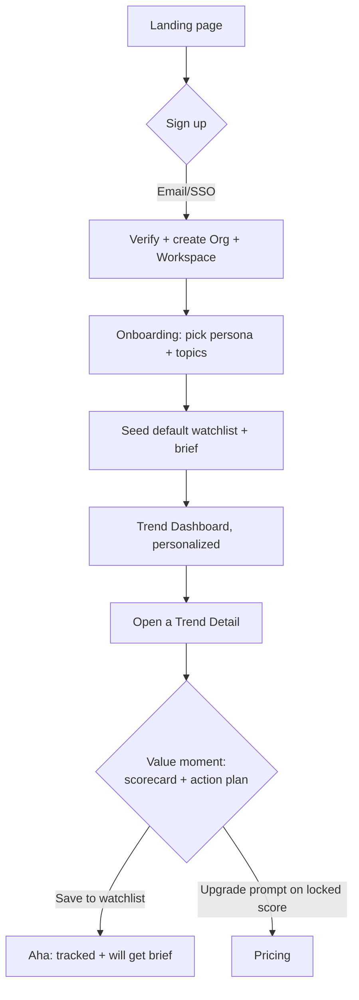
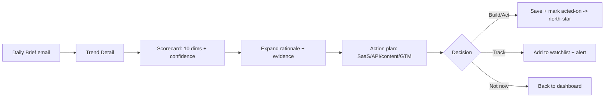

# UX Flows

**Phase 9 · Status: complete · Last updated: 2026-07-03**
**Traces to:** [User Stories](../01-product/USER_STORIES.md) · [IA](INFORMATION_ARCHITECTURE.md)

Primary flows as step sequences + decision points. Diagrams are textual (Mermaid) so they live in
version control; rendered ERD/sequence diagrams collected in `docs/diagrams/`.

## F1 — Activation (signup → first value)

**Design intent:** reach the scorecard (value moment) in < 60s from signup. Onboarding is 2 steps max.
Empty states teach; no dead ends.

## F2 — Core research loop (the daily habit)

## F3 — Watchlist & alert setup
Steps: from any trend/entity → "Add to watchlist" → choose/create watchlist → configure alert
(trigger: new trend | score crosses band | new funding; channel: in-app/email[/Slack…]; cadence:
instant/daily digest) → confirm. **Decision point:** if free tier watchlist limit reached → upgrade prompt.

## F4 — Team collaboration (R2)
Owner invites member (role) → member joins org → shared workspace visible → shared watchlists/reports →
role gates edit vs view. Billing changes restricted to Owner/Billing roles.

## F5 — Upgrade / billing
Trigger (locked feature or usage limit) → Pricing → Stripe Checkout → webhook confirms → entitlements
updated → feature unlocked in-session (optimistic + reconciled). Manage/downgrade via billing portal.

## F6 — API key lifecycle (R2)
Settings → API → create key (scope + name) → key shown once (hashed at rest) → usage dashboard (calls,
rate-limit, cost) → rotate/revoke. Metering feeds Stripe usage billing.

## F7 — Error / degraded states (cross-cutting)
- Ingestion source down → trend freshness badge "stale"; no hard failure.
- Score generation pending → skeleton + "scoring…" with confidence-unknown badge, never a blank.
- Search timeout → retry affordance + cached last results.
- Payment failed → non-destructive banner + retry; grace period before downgrade.

## Flow quality checklist
- [x] Every flow has a clear entry, value moment, and no dead ends.
- [x] Free→paid upgrade prompts placed at natural limits, not nagging.
- [x] Empty/loading/error states defined for every data surface (ties to Design System).
- [x] Activation flow reaches value in ≤ 2 onboarding steps.
