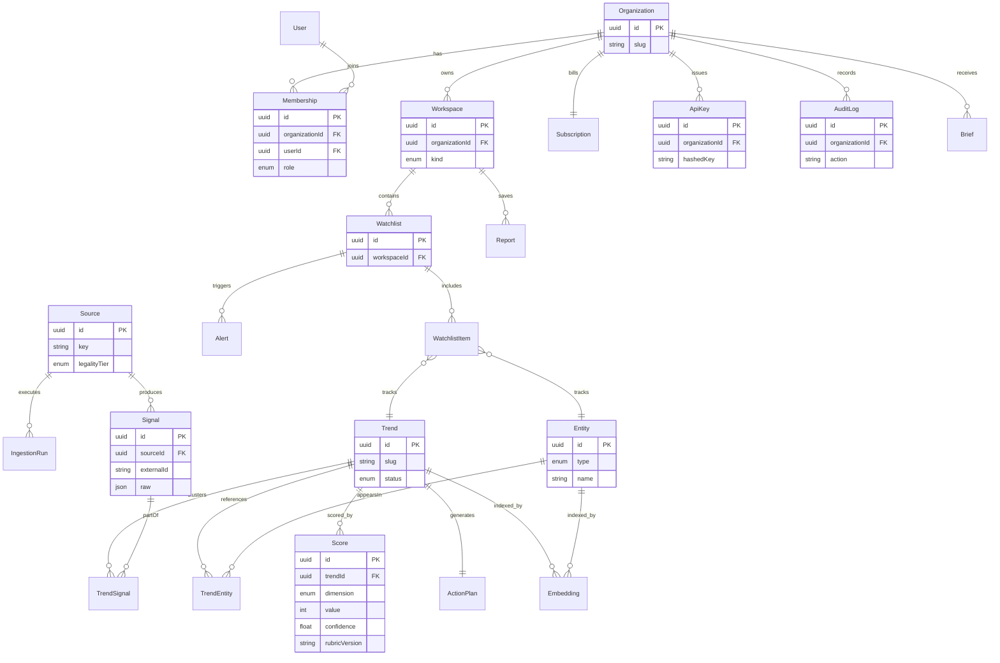

# Entity-Relationship Diagram (ERD)

**Phase 13 · Status: complete · Last updated: 2026-07-03**
**Companion to:** [DATABASE_DESIGN](DATABASE_DESIGN.md). Rendered from Mermaid.

## Legend & notes

- **Global (shared intelligence):** Source, IngestionRun, Signal, Trend, TrendSignal, Entity,
  TrendEntity, Score, ActionPlan, Embedding.
- **Tenant-owned (RLS by `organizationId`):** Organization, Workspace, Membership, User(link),
  Watchlist(+Item), Alert, Brief, Report, ApiKey, Subscription, AuditLog.
- `WatchlistItem` polymorphically tracks either a `Trend` or an `Entity` (typed discriminator).
- `Score` is versioned by `rubricVersion` (history preserved; latest = current rubric).
